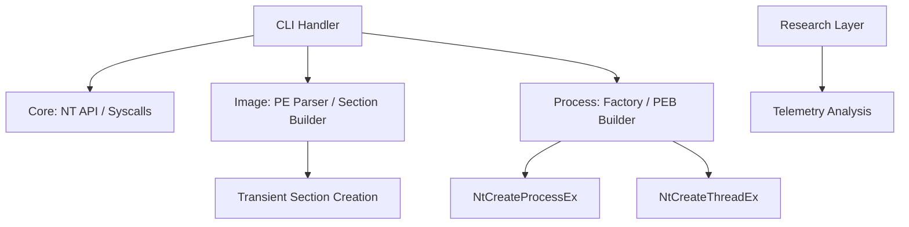

# 🔬 NullSection – Advanced Native Image Execution Framework

NullSection is a research-grade Windows execution framework designed to create and run executable images without persistent disk-backed files. By leveraging native NT APIs and image section manipulation, it demonstrates execution from transient or logically removed file objects.

This platform is built for **Windows internals research**, **forensic analysis**, and **security instrumentation**. It focuses on deep control over process creation internals and forensic ambiguity at both user-mode and kernel-observable layers.

> [!IMPORTANT]
> **Ethical Use Disclaimer**: NullSection is not a malware builder. It is a low-level research tool. Use it only for authorized security research, educational purposes, and defensive development.

---

## 🧠 Core Conceptual Pillars

- **No Long-Lived Disk Artifacts**: Executable images are backed by transient or logically removed file objects.
- **MEM_IMAGE Sections**: Created through native `NtCreateSection` calls with `SEC_IMAGE`.
- **Manual Process Orchestration**: Process environment and threading are built manually, bypassing high-level Win32 abstractions.
- **Forensic Ambiguity**: Engineered to exhibit forensic inconsistencies for research purposes (e.g., image name resolution anomalies).

---

## ✨ Advanced Research Features

- **Manual PEB Population**: Bypasses default loader initialization. Supports manual construction of `RTL_USER_PROCESS_PARAMETERS` and string buffer isolation in remote memory.
- **PPID Spoofing**: Supports arbitrary parent process assignment via `NtCreateProcessEx` to research parent-child relationship telemetry.
- **Syscall Layer**: Research reference for indirect syscall patterns and SSN resolution.
- **Manual Image Mapping**: Alternative mapping logic for research into memory-based execution without relying on `SEC_IMAGE`.
- **Handle Table Telemetry**: Forensic analysis of process handle tables via `ProcessHandleInformation`.

---

## 🏗️ Architecture Overview

NullSection follows a modular C++20 design, ensuring clear separation of concerns.



### High-Level Modules

- **`core/`**: NT API dynamic resolution, memory manipulation, and syscall research placeholders.
- **`image/`**: Hardened PE header parsing and memory-backed section construction.
- **`process/`**: Orchestration of `NtCreateProcessEx` and manual remote PEB population.
- **`evasion/`**: Observational telemetry and forensic footprint analysis.
- **`utils/`**: RAII handle wrappers, logging, and granular `NTSTATUS` translation.

---

## 🚀 Getting Started

### Building

```bash
# Clone the repository
git clone https://github.com/ismailtsdln/NullSection.git
cd NullSection

# Configure and build (CMake 3.20+)
mkdir build && cd build
cmake ..
cmake --build . --config Release
```

### Usage

Run a payload from a transient file object:

```bash
nullsection.exe run --image C:\path\to\payload.exe
```

Advanced Research: Manual PEB and PPID Spoofing:

```bash
nullsection.exe run --image C:\path\to\payload.exe --manual-peb --ppid 1234
```

---

## 🛠️ Reliability & Safety

The framework has been hardened with professional-grade safety features:

- **Remote Pointer Safety**: `PebBuilder` correctly handles remote memory allocation for string data, ensuring pointers are valid in the target process.
- **Hardened PE Parsing**: Strict validation for `e_lfanew` and section headers prevents crashes on malformed research binaries.
- **Granular Exceptions**: Specialized `NtException` system with an expanded `NTSTATUS` translation dictionary.

---

## 🧾 Documentation

- **[Implementation Walkthrough](walkthrough.md)**: Detailed breakdown of the execution flow.
- **[Task Roadmap](task.md)**: Current development status and research goals.

---

## 🔚 Final Notes

NullSection is engineered to feel like it was written by a Windows kernel engineer. It prioritizes **correctness over obfuscation** and **documentation over secrecy**.
