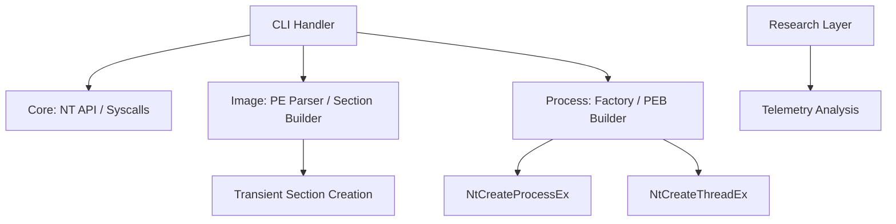

# 🔬 NullSection – Advanced Native Image Execution Framework

NullSection is a research-grade Windows execution framework designed to create and run executable images without persistent disk-backed files. By leveraging native NT APIs and image section manipulation, it demonstrates execution from transient or logically removed file objects.

This platform is built for **Windows internals research**, **forensic analysis**, and **security instrumentation**. It focuses on deep control over process creation internals and forensic ambiguity at both user-mode and kernel-observable layers.

> [!IMPORTANT]
> **Ethical Use Disclaimer**: NullSection is not a malware builder. It is a low-level research tool. Use it only for authorized security research, educational purposes, and defensive development.

---

## 🧠 Core Conceptual Pillars

- **No Long-Lived Disk Artifacts**: Executable images are backed by transient or logically removed file objects.
- **MEM_IMAGE Sections**: Created through native `NtCreateSection` calls with `SEC_IMAGE`.
- **Manual Process Orchestration**: Process environment and threading are built manually, bypassing high-level Win32 abstractions.
- **Minimal observable Metadata**: Engineered to exhibit forensic inconsistencies for research purposes.

---

## 🏗️ Architecture Overview

NullSection follows a modular C++20 design, ensuring clear separation of concerns.



### High-Level Modules

- **`core/`**: NT API dynamic resolution, undocumented structures, and Object Manager utilities.
- **`image/`**: Manual PE header parsing and memory-backed section construction.
- **`process/`**: Orchestration of `NtCreateProcessEx` and manual thread initialization.
- **`evasion/`**: Observational telemetry and footprint analysis (Handle tables, Image name resolution).
- **`utils/`**: RAII handle wrappers, logging, and granular exception handling.

---

## ⚙️ Technical Requirements

- **Language**: C++20 (Modern C++ standards).
- **Tooling**: MSVC (Visual Studio 2022+) or `clang-cl`.
- **Dependency**: Zero CRT dependency where avoidable; minimal reliance on standard Win32 exports.
- **OS Compatibility**: Windows 10 / 11 (x64).

---

## 🚀 Getting Started

### Prerequisites

- [CMake](https://cmake.org/download/) (3.20+)
- [Visual Studio](https://visualstudio.microsoft.com/) with C++ Desktop Development workload.

### Building

```bash
# Clone the repository
git clone https://github.com/ismailtsdln/NullSection.git
cd NullSection

# Configure and build
mkdir build
cd build
cmake ..
cmake --build . --config Release
```

### Usage

Run a payload from a transient file object:

```bash
nullsection.exe run --image C:\path\to\your\payload.exe
```

Analyze process telemetry (Research Mode):

```bash
nullsection.exe inspect --image payload.exe
```

---

## 🕵️ Research & Evasion Layer

NullSection provides built-in tools for observational research:

- **Handle Table Visibility**: Analysis of how the transient file handle is managed in the process object.
- **Image Name Resolution**: Monitoring inconsistencies in how user-mode tools (e.g., Process Hacker, Sysmon) resolve the process backing image.
- **Remote PEB Manipulation**: Demonstration of manual Environment Block and Process Parameter population.

---

## 🛠️ Error Handling & Reliability

The framework implements a professional, granular exception system:

- **`NtException`**: Translates cryptic `NTSTATUS` (e.g., `0xC0000005`) into human-readable strings.
- **`Win32Exception`**: Standardized reporting for Win32 API failures.
- **Defensive Validation**: Strict input sanitization for all pointers and file paths.

---

## 🧾 Documentation & Reference

- **[Implementation Walkthrough](walkthrough.md)**: Detailed breakdown of the execution flow.
- **[Task List](task.md)**: Current development status and roadmap.

---

## 🔚 Final Notes

NullSection is engineered to feel like it was written by a Windows kernel engineer. It prioritizes **correctness over obfuscation** and **documentation over secrecy**. Every undocumented behavior leveraged in this framework is documented for the academic benefit of senior security researchers.
